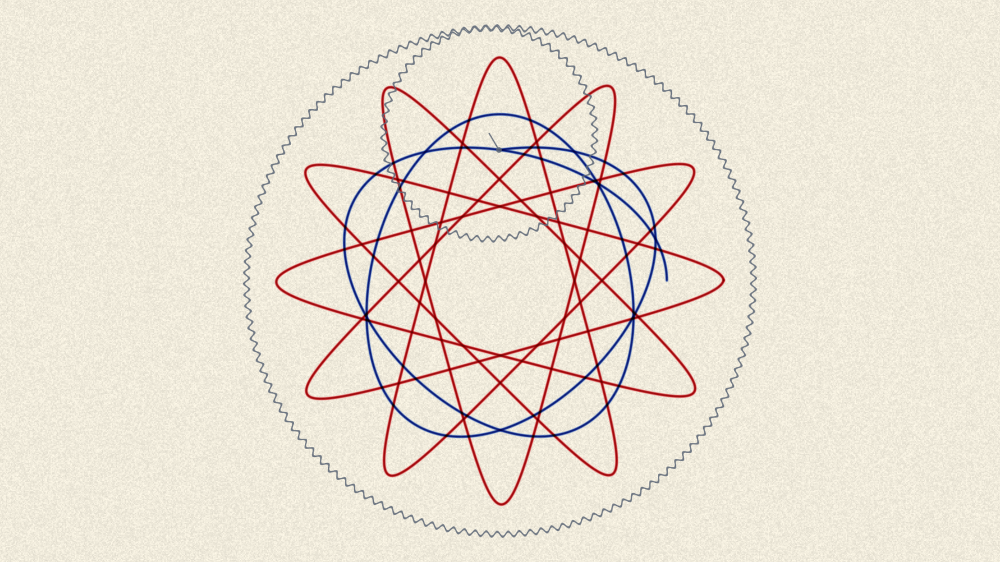
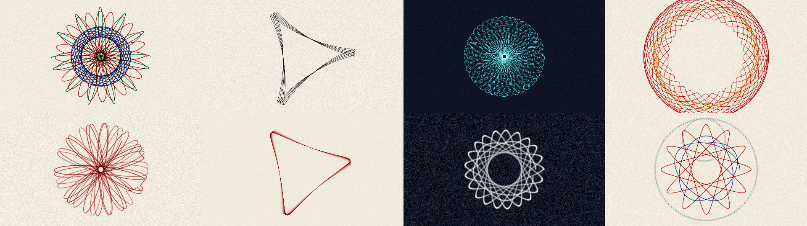
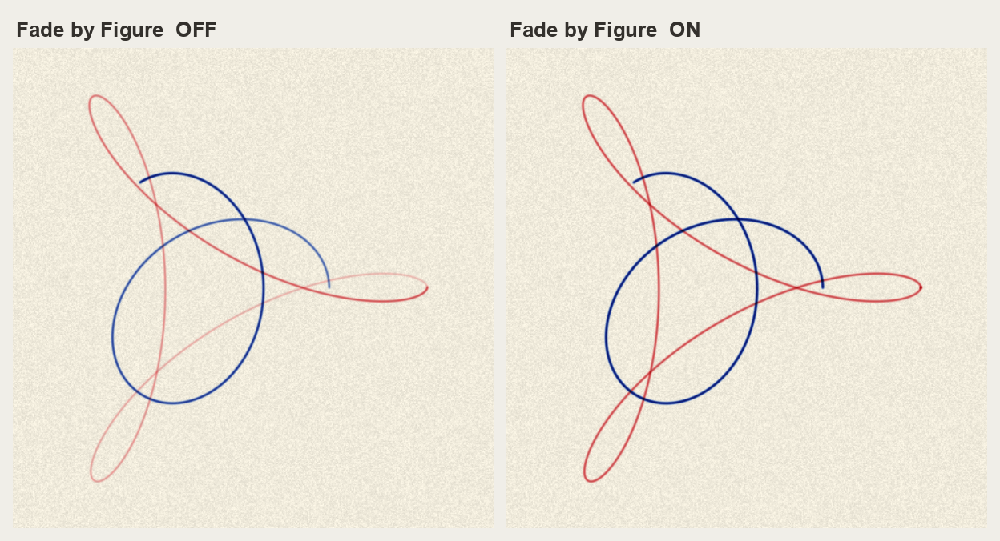

# Cogwheel user guide

Cogwheel is **a Spirograph**, as two plugins for Resolume Arena and Avenue — and again as an
OpenFX bundle for Resolve, Vegas, Nuke and Natron.

A toothed ring is pinned to the paper. A smaller toothed wheel rolls around inside it, in mesh,
and a pen dropped through one of the wheel's holes is carried along for the ride. **Nothing here
evaluates a curve.** Set the two tooth counts and the figure follows.



> **Before you rely on this:** the central claims are measured rather than asserted. The pen is
> walked for the full number of turns the tooth counts predict and the test fails if it does not
> come home; a second fails unless two pens crossing transmit the *product* of what each transmits
> alone, which is what makes ink subtractive rather than additive. Both probe the same code that
> ships, and a control sweep fails if any parameter turns out to do nothing.
>
> **Both plugins have been loaded and run in Resolume Arena 7.27.1, on macOS and on Windows** —
> they register with the right names and categories, expose all 48 controls with nothing
> truncated, render, and hold a factory preset through live rendering. **DaVinci Resolve Studio
> 21.0.2.4 lists the OpenFX build**, and it renders correctly in an independent OFX host. What is
> still unconfirmed is narrower: the OpenFX build has not been driven over a clip inside Resolve,
> so its CPU renderer is proven to run and not yet proven to match the GPU one pixel for pixel.
>
> Released at **v0.2.0**.
>
> This codebase was created with AI assistance, directed and reviewed by a human author.

*Spirograph* is a registered trademark of Hasbro, Inc. This project is not affiliated with,
endorsed by, or connected to Hasbro. The name is used only to describe the kind of machine the
plugin models.

---

## Two plugins

- **Cogwheel** (a source) draws on its own sheet of paper.
- **Cogwheel Ink** (an effect) can use the clip below as the paper the pen draws on, as the ink
  the pen picks up, or both.

Both declare the same parameters, so a composition can be moved between them.

---

## Start from a preset

The **Preset** dropdown is at the bottom of the list. Eight of them, and each is a recognisable
*drawing* rather than a set of slider positions — which is only possible because the gear train is
two integers.



| Preset | What it is |
| --- | --- |
| **Classic Rosette** | 96 and 52, four pens through four holes. The one everybody made first. |
| **Three Lobes** | 96 and 32 mesh three to one, so the figure closes in a single turn. The pen never lifts, and a mesh half a tooth out of true walks it round the sheet. |
| **Dense Web** | 105 and 64 share no factor at all: sixty-four turns and a hundred and five lobes, printed as a negative. |
| **Flower** | Outside the ring instead of inside — the petal shape rather than the rosette. |
| **Slipping Gear** | The ruined drawing, on purpose. A mesh well out of true and a three-tooth jump every few turns. |
| **Wet Trail** | Not a drawing: a trail. A fibre tip against a two-second fade. |
| **Chalkboard** | Graphite, a heavy tooth and a wide soft nib, printed as a negative. |
| **Show the Gears** | The machine on screen — ring, wheel, arm and pen — cranked slowly. |

### Keeping a look of your own

The presets are fixed — Resolume gives a plugin no way to add an entry to that dropdown
while it is running, or to remember one between sessions. So there is no "save preset"
button, and there cannot be one.

What there is instead is a pair of controls next to the dropdown. **Export XML** writes every
control's current value to a timestamped file:

    ~/Documents/cogwheel/cogwheel-20260901-152822.xml

Each line carries both the number the plugin stores and the readable version of it, so the
file is worth reading as well as keeping:

```xml
<parameter id="1" name="Ring Teeth" type="integer" value="96.000000" display="96t - 24 lobes"/>
<parameter id="8" name="Speed" type="standard" value="0.737000" display="1.63 turns/s"/>
```

**Load XML**, new in v0.3.0, reads one back. It is a file picker: choose a file and every
control the file names is set from it, the sheet is wiped for the new machine, and the Preset
dropdown drops to **Custom**, because the file is now the truth. The row next to it says
`loaded`, or `failed - see log`. The full path — and any row the plugin could not place — goes
to the diagnostics log, because sixteen characters of parameter display is not room for one.

Three things worth knowing:

- **Rows are matched by name, never by number.** A file written by the source loads into the
  effect and back, and a file from an earlier release still loads even though the controls have
  been renumbered since. A row naming a control that does not exist is skipped and logged.
- **Choosing the same file a second time does nothing.** A file is applied when the path
  *changes*, so a host that restates the same path every frame does not wipe the sheet every
  frame. To re-apply a file you have edited, pick a different one and then it again.
- **A loaded file is held the way a preset is.** Resolume goes on pushing the slider values it
  believed before the load; the plugin recognises those as the host repeating itself rather
  than as you editing, and keeps the file's values until you actually move something.

The About block and the buttons are not settings and are not loaded, and a hand-edited value
outside a control's range is clamped to the range rather than applied.

Moving any control a preset covers drops the dropdown back to **Custom**. That is the preset
letting go, not an error.

---

## The two numbers that matter

**Ring Teeth** and **Wheel Teeth** are the whole machine. Because gears mesh, the wheel cannot
roll by anything other than a whole tooth, so everything about the figure follows from those two
integers:

| Ring | Wheel | Lobes | Turns to close |
| ---: | ----: | ----: | -------------: |
| 96 | 32 | 3 | 1 |
| 96 | 52 | 24 | 13 |
| 96 | 31 | 96 | 31 |

Drag either control and Resolume shows you the answer before you let go — the Ring reports how
many lobes you are about to get, and the Wheel reports how many turns it will take to close.

**Snap to Set** restricts both to tooth counts a real Spirograph set carries. Leave it on unless
you are hunting for something specific; the figures people recognise are the ones those particular
integers make.

**Pen Hole** is which hole in the wheel the pen sits in. Near the rim gives long thin lobes; near
the axle gives something close to a circle. **Snap to Holes** restricts it to the twelve modelled
positions, which is what a real wheel offers.

**Mesh** decides whether the wheel runs round the inside of the ring (a rosette) or the outside
(a petal shape).

A wheel as big as the ring, or bigger, cannot run round the *inside* of it — there is nowhere for
it to go — so with Mesh on *Inside* and 100 wheel teeth against 96 ring teeth nothing is drawn.
The two controls say so as you drag them: the Ring reads `too small` and the Wheel reads
`too big`. Set Mesh to *Outside*, where a big wheel is fine, or choose a smaller wheel.

---

## Why a drawing stops, and what to do about it

A closed figure retraces its own line for ever. That is not a bug and it is not something tuning
fixes — it is what a Spirograph *is*. A drawing is finished when it is finished, and about ten
seconds later nothing on screen is moving.

There are three ways out, and all three are things a person at the table actually does:

- **Creep** — the mesh is not quite true. A fraction of a tooth per turn precesses the figure so
  it never quite lands on itself, and the drawing keeps growing. This is on by default.
- **Skip** — a jumped tooth. Discrete, startling, and the classic way a real drawing is ruined.
  **Skip Size** is how far it jumps.
- **Layers** — when a figure closes, lift the pen, move to another hole, change the pen and draw
  the next one on top. That is how the multicoloured Spirograph drawing everybody remembers is
  actually made. **On Closing** decides what moves; **Wipe Sheet** starts a fresh sheet when the
  whole stack is done.

If the picture has gone still, one of those three is off.

---

## The pen

**Pen Type** is a real distinction between two real classes of pen, not a look.

- A **ballpoint**'s ball rolls, so it lays down ink per unit of *distance*: a line is the same
  darkness however fast your hand moved. That is what came in the box, and it is the default.
- A **fibre tip** feeds by capillary action, per unit of *time*, so it blooms wherever the pen
  slows down — which at a cusp is a great deal.

**Flow** is how dark the line is. It is multiplied by the nib's width internally, so widening the
nib does not lighten the line — a broader pen delivers proportionally more ink, which is what
makes it broader rather than blurrier.

**Nib** is the line's width, as a fraction of the sheet, so it is the same line at every output
resolution. **Pressure** is how much a pressed nib spreads.

**Pens** chooses what the layers are drawn with — *Four Pens* is the set that came in the box.
*Ink Colour* uses the **Ink Red**, **Ink Green** and **Ink Blue** sliders instead.

---

## Ink is subtractive, and what follows from it

The sheet accumulates optical density, and what you see is the paper through it. A second pen
crossing the first therefore gives the *product* of the two transmissions — the muddy near-black
it is on the table — rather than the bright sum an additive renderer would produce. A pen that
lingers lays down more.

Two consequences worth knowing:

- **Changing the paper colour or the palette does not spoil what is already drawn.** The sheet
  never held a colour to be wrong about.
- **Ink can only ever darken paper.** A pale line on a dark ground is not something the machine
  can make. **Print → Negative** is the honest route to it: a drawing, photographed and printed
  the other way up.
- **Black paper hides the drawing.** Turn the **Paper** sliders down to black and the ink has
  nothing to darken, so the whole sheet goes black — which is Beer's law, not a fault. If what
  you wanted was to key the paper out and composite the line over other layers, that is what
  **Clear Paper** is for.

**Clear Paper** takes the paper away altogether. The output is the ink on a clear sheet, with an
alpha channel: composite it over anything in Resolume and the line shows in its own colour, a
black pen darkens whatever is behind it exactly as ink would, and over white you get precisely the
drawing on white paper. The paper colour, **Grain** and **Paper from Clip** do not apply while it
is on, because there is no paper. On the effect the ink goes over the clip and the clip keeps its
own alpha.

**Grain** is how much of the paper's tooth you can see. **Tooth** is a different question — how
unevenly the sheet *takes* ink. Smooth board takes ink evenly and shows no grain; cartridge does
both.

**Fade** is the one control in the plugin that is not something the machine can do. A drawing does
not fade. It is here because a VJ needs the sheet to clear, and at zero it does not fade at all,
which is what paper does.

**Fade by Figure** decides what the fade acts on. Off — which is how it has always behaved — the
fade acts on the sheet, every frame. Ink laid down at the start of a figure has therefore been
fading for longer than ink laid down at its head, so the line carries a gradient along its own
length: it is palest where the pen started and darkest where the pen is now. On, the figure being
drawn does not fade at all. It joins the drawing at the moment it closes, and fades from then on
as one object, so a figure is a single even weight of line and the ones behind it lift away whole.

It needs **Fade** above zero to mean anything: with no fade there is nothing for it to change the
shape of. Turning it off again does not lose anything — everything that had settled comes straight
back onto the sheet.



The same machine and the same fade, at the same frame. On the left the blue figure is being drawn
and is palest where the pen started; on the right it is one weight of line all the way round, and
the red figure behind it has lifted away evenly rather than in a gradient.

---

## Cranking, and syncing to the music

**Speed** is turns of the ring per second.

> **Renamed in v0.2.0.** This control was called **Crank** in v0.1.0. Every other plugin in
> the range calls it Speed, so it now does too. Two things follow, and both bite silently:
> a composition saved against v0.1.0 loses whatever Crank was set to and opens at the
> default, and any OSC or MIDI mapping pointing at "Crank" stops arriving. Re-point the
> mapping and re-save the composition once, and that is the end of it.

**Sync** overrides it: choose 1, 2, 4 or 8 bars and the figure is given that many bars to
complete, whatever this particular train's turn count is. So a thirteen-turn figure and a
one-turn figure both land on the bar line together. That is the only sensible reading of "one
figure per phrase".

**New Sheet** throws the drawing away and starts again. It sits at the very top of the
parameter list, above every group, so it is always in reach — clearing the paper is the one
thing you want mid-show and it used to be folded away inside the Crank group.

**Detail** is how finely the pen path is walked — 360, 1440 or 5760 steps a turn. It is a cost
dial with a visible symptom: at *Draft* a big figure is faintly polygonal. It does **not** change
how much ink goes on the sheet.

**Show Gears** puts the ring, the wheel, the arm and the pen on screen, with the real tooth
counts, so they can be counted. It is the quickest way to explain the plugin to somebody standing
next to you.

---

## In OpenFX hosts

Copy `Cogwheel.ofx.bundle` to:

- **macOS** — `/Library/OFX/Plugins`
- **Windows** — `C:\Program Files\Common Files\OFX\Plugins`
- **Linux** — `/usr/OFX/Plugins`

⚠️ **On macOS it must be `/Library/OFX/Plugins`, which needs an administrator.** Putting it in
`~/Library/OFX/Plugins` is **silently ignored** — the plugin simply never appears, with nothing
logged and no error, which looks exactly like a broken plugin.

Two things behave differently there, both stated rather than hidden:

- **The OpenFX build renders on the CPU.** There is no OpenGL context to be had in an OFX host, so
  it is built for offline rendering rather than for live use.
- **A drawing is history, so it replays from the beginning.** A linear render costs nothing per
  frame beyond that frame's own strokes. Scrubbing *backwards* through a long drawing is slow, and
  gets slower the further in you are. There is no warm-up window that would fix this: one would
  produce a different drawing, missing everything laid down before the window opened. Render
  forwards.

**Sync** works off a fixed 120 bpm in OpenFX, because OFX carries no transport tempo.

**Export XML** and **Load XML** are here too. Resolve has its own presets, so they exist mainly to
share a look with the Resolume build: a file written by either loads in the other. In an OpenFX
host Load XML is a file path with a browse button.

---

## If it looks wrong

**The picture has stopped moving.** The figure has closed. Turn up **Creep**, raise **Layers**, or
add some **Skip**. See "Why a drawing stops" above.

**Everything is solid black.** **Flow** is too high for the crank rate. A dense figure crosses
itself constantly and every crossing darkens; *Dense Web* runs at a deliberately light flow for
exactly this reason.

**The drawing is off the edge of the frame.** Check **Size** and **Centre**. Size is the ring's
radius as a fraction of the frame height, so at 1.0 the ring exactly fills it.

**The lines look polygonal.** **Detail** is on *Draft*. Move it to *Normal*.

**Nothing draws, and Wheel Teeth reads `too big`.** The wheel is as big as the ring or bigger and
**Mesh** is on *Inside*. Set Mesh to *Outside* or choose a smaller wheel. The log says the same.

**Everything went black when I set the paper to black.** Ink only darkens paper, so on black paper
there is nothing to see. Use **Clear Paper** to key the sheet out, or **Print → Negative** for a
pale line on a dark ground.

**Nothing appears at all in Resolume.** Check `~/Library/Logs/cogwheel/` (macOS) or
`%LOCALAPPDATA%\cogwheel\logs\` (Windows). A shader that will not compile, or a sheet that would
not allocate, both look like "it does nothing" from outside and both say so there.

**A control does nothing.** Some are conditional: **Skip Size** needs **Skip Chance** above zero,
**On Closing** and **Pens** need **Layers** above one, the **Ink** sliders only apply when
**Pens** is set to *Ink Colour*, and **Ink from Clip** / **Paper from Clip** exist only on the
effect.
